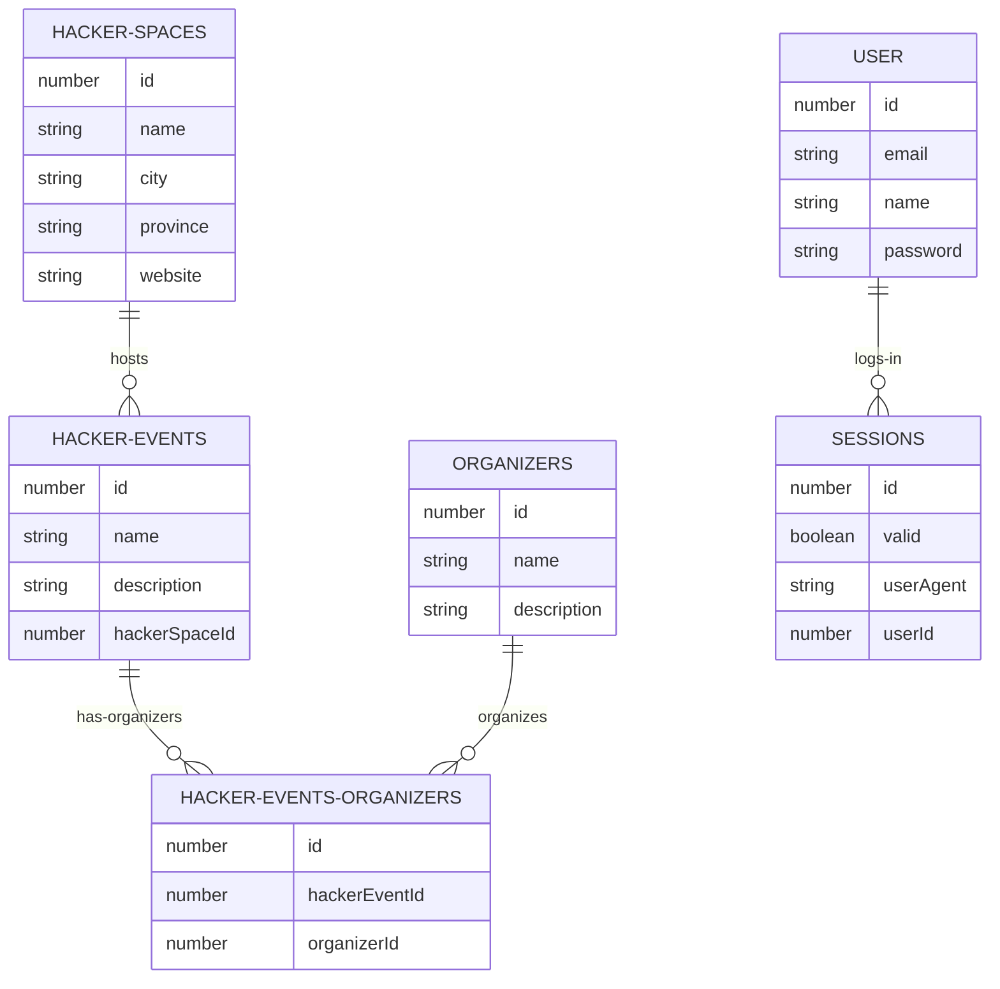

# hackhub.nl API   
    
> Events driven hackerspace communities in the Netherlands.   
         
REST API Proof of Concept for hackhub.nl in Node.js/TypeScript.     

> [!NOTE]
> Under construction - development only.            
   
## ER Diagram:


## Requirements
Node.js, NPM and PostgreSQL installed.    

## Instructions:
Create `hackhub` database in PostgreSQL.   
    
Copy `.env.example` into `.env` and set values.    
            
Install dependencies:    
```
npm install
```    

Start the server: 
```
npm start
```    
           
Start the server only for development: 
```
npm run dev
```    
    
Start the server only for build: 
```
npm run build
```    
             
Run all tests:    
```
npm test
```    
        
## Test the API    
For testing with Postman import [postman_collection.json](./postman_collection.json)    
   
## License:   
[MIT](./LICENSE)   