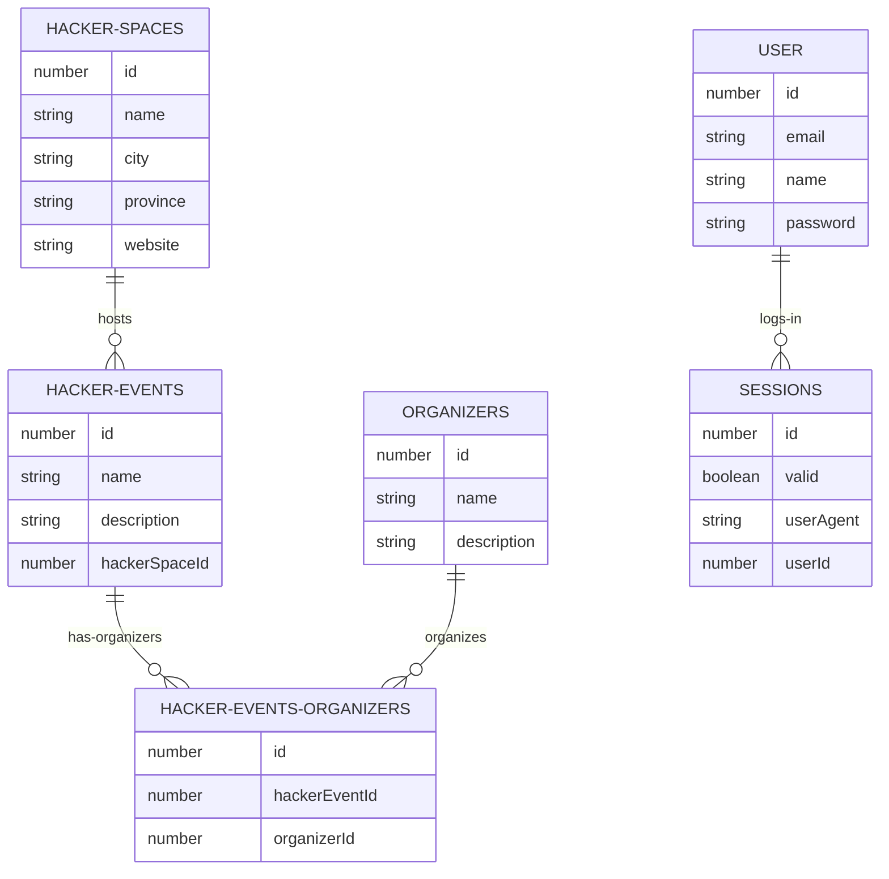

# hackhub.nl API   
    
> Events driven hackerspace communities in the Netherlands.   
         
REST API Proof of Concept for hackhub.nl in Node.js/TypeScript.     
             
## ER Diagram:

## Instructions:    
    
Copy `.env.example` into `.env` and generate keys.     
    
Start app, db and pgAdmin in Docker: `docker-compose up`     
    
Configure database in pgAdmin4:       
- Navigate to: `localhost:5050`       
- Create new server: `postgres`                
- Create db: `hackhub`      
    
## Routes and requests:   
- Admin routes: `http://localhost:7000/api/admin/...`    
- Visitor routes: `http://localhost:7000/api/...`     
- Routes documentation (import Postman collection): [postman_collection.json](./postman_collection.json)    
   
## License:   
[MIT](./LICENSE)   