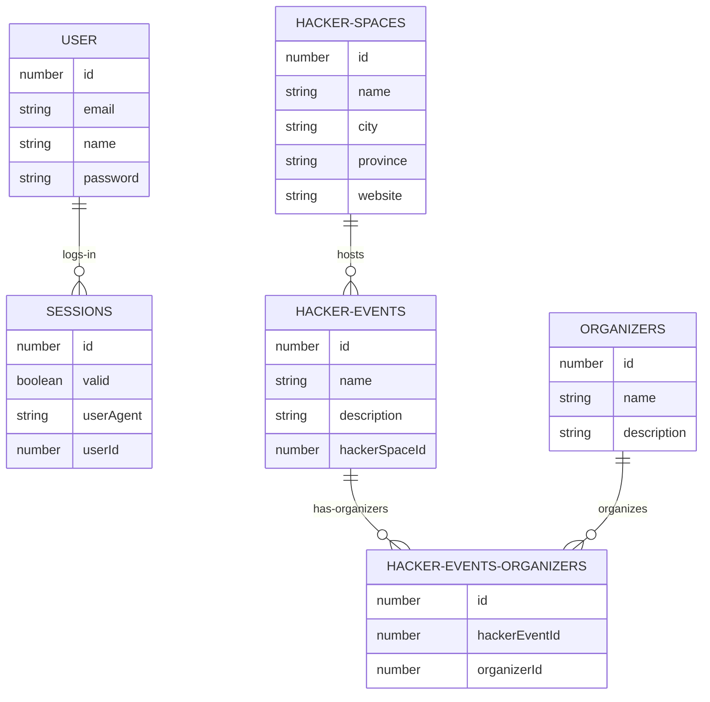

# hackhub-api-poc  

### Requirements
Node.js, NPM and PostgreSQL installed.    

### Instructions:
- Create `hackhub` database in PostgreSQL.   
- Rename `.env.example` to `.env` and set values.    
     
- Install dependencies:    
```
npm install
```            
- Start the server: 
```
npm run dev
```          
- Run all tests:    
```
npm test
```  
    
### ER Diagram:
