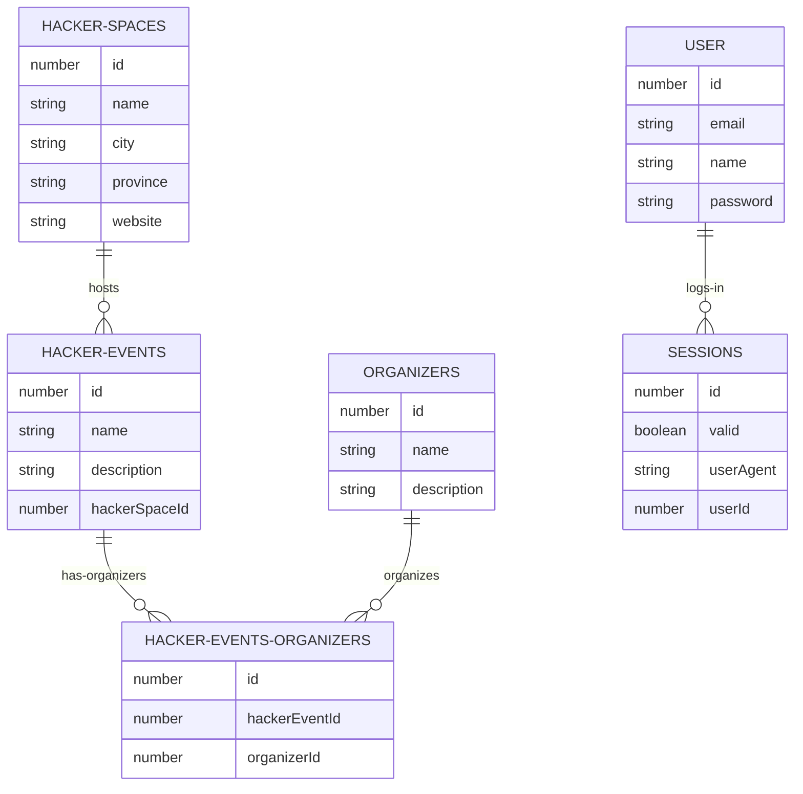

# hackhub.nl API   
            
REST API Proof of Concept for hackhub.nl in Node.js/TypeScript.     
             
## Instructions:    

### 1. Postman setup:    
- Add environment (give it a name) in Postman (top right corner).   
- Import Postman collection: [postman_collection.json](./postman_collection.json).      
    
### 2. Project setup:    
- Copy `.env.example` into `.env`.      
- Generate public and private keys and set in `.env` file.     
    
### 3. Start Docker:    
- Start app and pgAdmin in Docker: `docker-compose up`        
           
### 4. Database setup (configure database in pgAdmin4):             
- Navigate to: `localhost:5050`       
- Create new server: `postgres`                
- Set the server parameters:     
```
POSTGRES_HOST=postgres
POSTGRES_PORT=5432
POSTGRES_USER=postgres
POSTGRES_PASSWORD=postgres
POSTGRES_DB=hackhub
```   
- Create db: `hackhub`      

### 5. Restart Docker to create the database:    
`docker-compose up`     
            
## ER Diagram:

   
## Routes and requests:   
- Admin routes: `http://localhost:7000/api/admin/...`    
- Visitor routes: `http://localhost:7000/api/...`        

## License:   
[MIT](./LICENSE)   